# Plan de Integración: Firebase Cloud Messaging (FCM) con Supabase

## 📋 Resumen Ejecutivo

Este documento describe el plan completo para integrar **Firebase Cloud Messaging (FCM)** con **Supabase** para habilitar notificaciones push en tiempo real en el sistema SIEP.

**Estado Actual:** ✅ Sistema de notificaciones in-app completado (panel de notificaciones en el header)

**Próximo Paso:** 🔔 Agregar notificaciones push para alertas cuando el usuario no está en la aplicación

---

## 🎯 Objetivos

1. **Notificaciones Push:** Enviar alertas al navegador/dispositivo del usuario incluso cuando la app está cerrada
2. **Multi-dispositivo:** Soportar múltiples dispositivos por usuario (laptop, celular, tablet)
3. **Persistencia:** Mantener historial de notificaciones en Supabase
4. **Seguridad:** Implementar con políticas RLS y credenciales seguras
5. **Escalabilidad:** Usar infraestructura de Google para entrega masiva

---

## 🏗️ Arquitectura

```mermaid
sequenceDiagram
    participant User as Usuario (Navegador)
    participant Next as Next.js (Frontend)
    participant DB as Supabase DB
    participant Edge as Supabase Edge Function
    participant FCM as Firebase Cloud Messaging

    Note over User, DB: 1. Registro del Dispositivo
    User->>Next: Acepta recibir notificaciones
    Next->>FCM: Solicita Token de Registro
    FCM-->>Next: Retorna Token (ej: "f4a2...")
    Next->>DB: Guarda Token en tabla 'user_fcm_tokens'

    Note over DB, User: 2. Creación de Notificación
    DB->>DB: INSERT en tabla 'notifications'
    DB->>Edge: Trigger/Webhook activa Edge Function
    Edge->>DB: Consulta tokens del usuario
    DB-->>Edge: Retorna tokens activos
    Edge->>FCM: Envía payload usando Firebase Admin SDK
    FCM-->>User: 🔔 Muestra Notificación Push
```



---

## 📦 Componentes Necesarios

### 1. Firebase Project Setup

**Pasos:**
1. Ir a [Firebase Console](https://console.firebase.google.com/)
2. Crear nuevo proyecto o usar existente
3. Habilitar Cloud Messaging
4. Obtener credenciales:
   - **Web Config** (para frontend):
     ```javascript
     {
       apiKey: "AIza...",
       authDomain: "proyecto.firebaseapp.com",
       projectId: "proyecto-id",
       storageBucket: "proyecto.appspot.com",
       messagingSenderId: "123456789",
       appId: "1:123456789:web:abc123"
     }
     ```
   - **Service Account** (para backend):
     - Ir a Project Settings > Service Accounts
     - Generar nueva clave privada (JSON)
     - Guardar como `firebase-service-account.json`

### 2. Base de Datos (Supabase)

**Nueva tabla: `user_fcm_tokens`**

```sql
-- Tabla para almacenar tokens FCM de dispositivos
CREATE TABLE IF NOT EXISTS public.user_fcm_tokens (
  id UUID DEFAULT gen_random_uuid() PRIMARY KEY,
  user_id UUID NOT NULL REFERENCES auth.users(id) ON DELETE CASCADE,
  token TEXT NOT NULL UNIQUE,
  device_info JSONB DEFAULT '{}'::jsonb, -- Opcional: info del navegador/dispositivo
  last_used_at TIMESTAMPTZ DEFAULT NOW(),
  created_at TIMESTAMPTZ DEFAULT NOW(),
  updated_at TIMESTAMPTZ DEFAULT NOW()
);

-- Índices
CREATE INDEX idx_user_fcm_tokens_user_id ON public.user_fcm_tokens(user_id);
CREATE INDEX idx_user_fcm_tokens_token ON public.user_fcm_tokens(token);

-- RLS Policies
ALTER TABLE public.user_fcm_tokens ENABLE ROW LEVEL SECURITY;

-- Los usuarios pueden ver sus propios tokens
CREATE POLICY "Users can view their own tokens"
  ON public.user_fcm_tokens
  FOR SELECT
  USING (auth.uid() = user_id);

-- Los usuarios pueden insertar sus propios tokens
CREATE POLICY "Users can insert their own tokens"
  ON public.user_fcm_tokens
  FOR INSERT
  WITH CHECK (auth.uid() = user_id);

-- Los usuarios pueden actualizar sus propios tokens
CREATE POLICY "Users can update their own tokens"
  ON public.user_fcm_tokens
  FOR UPDATE
  USING (auth.uid() = user_id)
  WITH CHECK (auth.uid() = user_id);

-- Los usuarios pueden eliminar sus propios tokens
CREATE POLICY "Users can delete their own tokens"
  ON public.user_fcm_tokens
  FOR DELETE
  USING (auth.uid() = user_id);

-- Trigger para actualizar updated_at
CREATE OR REPLACE FUNCTION update_user_fcm_tokens_updated_at()
RETURNS TRIGGER AS $$
BEGIN
  NEW.updated_at = NOW();
  RETURN NEW;
END;
$$ LANGUAGE plpgsql;

CREATE TRIGGER update_user_fcm_tokens_updated_at_trigger
  BEFORE UPDATE ON public.user_fcm_tokens
  FOR EACH ROW
  EXECUTE FUNCTION update_user_fcm_tokens_updated_at();
```

### 3. Frontend (Next.js)

**Archivos a crear:**

#### `lib/firebase/config.ts`
```typescript
import { initializeApp, getApps } from 'firebase/app';
import { getMessaging, isSupported } from 'firebase/messaging';

const firebaseConfig = {
  apiKey: process.env.NEXT_PUBLIC_FIREBASE_API_KEY,
  authDomain: process.env.NEXT_PUBLIC_FIREBASE_AUTH_DOMAIN,
  projectId: process.env.NEXT_PUBLIC_FIREBASE_PROJECT_ID,
  storageBucket: process.env.NEXT_PUBLIC_FIREBASE_STORAGE_BUCKET,
  messagingSenderId: process.env.NEXT_PUBLIC_FIREBASE_MESSAGING_SENDER_ID,
  appId: process.env.NEXT_PUBLIC_FIREBASE_APP_ID,
};

// Inicializar Firebase solo una vez
const app = getApps().length === 0 ? initializeApp(firebaseConfig) : getApps()[0];

// Obtener instancia de messaging (solo en cliente)
export const getMessagingInstance = async () => {
  const supported = await isSupported();
  return supported ? getMessaging(app) : null;
};

export default app;
```

#### `public/firebase-messaging-sw.js`
```javascript
// Service Worker para recibir notificaciones en segundo plano
importScripts('https://www.gstatic.com/firebasejs/10.7.1/firebase-app-compat.js');
importScripts('https://www.gstatic.com/firebasejs/10.7.1/firebase-messaging-compat.js');

firebase.initializeApp({
  apiKey: "TU_API_KEY",
  authDomain: "TU_AUTH_DOMAIN",
  projectId: "TU_PROJECT_ID",
  storageBucket: "TU_STORAGE_BUCKET",
  messagingSenderId: "TU_MESSAGING_SENDER_ID",
  appId: "TU_APP_ID"
});

const messaging = firebase.messaging();

// Manejar notificaciones en segundo plano
messaging.onBackgroundMessage((payload) => {
  console.log('[firebase-messaging-sw.js] Received background message ', payload);
  
  const notificationTitle = payload.notification.title;
  const notificationOptions = {
    body: payload.notification.body,
    icon: '/images/logo-universidad-transparente.png',
    badge: '/images/logo-oficial.png',
    data: payload.data
  };

  self.registration.showNotification(notificationTitle, notificationOptions);
});

// Manejar clics en notificaciones
self.addEventListener('notificationclick', (event) => {
  event.notification.close();
  
  const urlToOpen = event.notification.data?.url || '/';
  
  event.waitUntil(
    clients.matchAll({ type: 'window', includeUncontrolled: true })
      .then((windowClients) => {
        // Buscar si ya hay una ventana abierta
        for (let client of windowClients) {
          if (client.url === urlToOpen && 'focus' in client) {
            return client.focus();
          }
        }
        // Si no, abrir nueva ventana
        if (clients.openWindow) {
          return clients.openWindow(urlToOpen);
        }
      })
  );
});
```

#### `hooks/useFCM.ts`
```typescript
import { useEffect, useState } from 'react';
import { getToken, onMessage } from 'firebase/messaging';
import { getMessagingInstance } from '@/lib/firebase/config';
import { createClient } from '@/lib/supabase/client';
import { useSupabaseSession } from '@/components/providers/SessionProvider';

export function useFCM() {
  const [token, setToken] = useState<string | null>(null);
  const [permission, setPermission] = useState<NotificationPermission>('default');
  const { session } = useSupabaseSession();
  const supabase = createClient();

  useEffect(() => {
    if (!session?.user?.id) return;

    const setupFCM = async () => {
      try {
        // Verificar soporte
        const messaging = await getMessagingInstance();
        if (!messaging) {
          console.log('FCM no soportado en este navegador');
          return;
        }

        // Verificar permiso actual
        const currentPermission = Notification.permission;
        setPermission(currentPermission);

        if (currentPermission === 'granted') {
          // Obtener token
          const currentToken = await getToken(messaging, {
            vapidKey: process.env.NEXT_PUBLIC_FIREBASE_VAPID_KEY
          });

          if (currentToken) {
            setToken(currentToken);
            
            // Guardar token en Supabase
            await saveTokenToDatabase(currentToken);

            // Escuchar mensajes en primer plano
            onMessage(messaging, (payload) => {
              console.log('Mensaje recibido en primer plano:', payload);
              
              // Mostrar notificación personalizada o actualizar UI
              if (payload.notification) {
                new Notification(payload.notification.title || 'Nueva notificación', {
                  body: payload.notification.body,
                  icon: '/images/logo-universidad-transparente.png'
                });
              }
            });
          }
        }
      } catch (error) {
        console.error('Error al configurar FCM:', error);
      }
    };

    setupFCM();
  }, [session?.user?.id]);

  const requestPermission = async () => {
    try {
      const permission = await Notification.requestPermission();
      setPermission(permission);

      if (permission === 'granted') {
        const messaging = await getMessagingInstance();
        if (!messaging) return null;

        const currentToken = await getToken(messaging, {
          vapidKey: process.env.NEXT_PUBLIC_FIREBASE_VAPID_KEY
        });

        if (currentToken) {
          setToken(currentToken);
          await saveTokenToDatabase(currentToken);
          return currentToken;
        }
      }
      return null;
    } catch (error) {
      console.error('Error al solicitar permiso:', error);
      return null;
    }
  };

  const saveTokenToDatabase = async (fcmToken: string) => {
    if (!session?.user?.id) return;

    try {
      // Verificar si el token ya existe
      const { data: existing } = await supabase
        .from('user_fcm_tokens')
        .select('id')
        .eq('token', fcmToken)
        .single();

      if (!existing) {
        // Insertar nuevo token
        const { error } = await supabase
          .from('user_fcm_tokens')
          .insert({
            user_id: session.user.id,
            token: fcmToken,
            device_info: {
              userAgent: navigator.userAgent,
              platform: navigator.platform
            }
          });

        if (error) {
          console.error('Error al guardar token:', error);
        }
      } else {
        // Actualizar last_used_at
        await supabase
          .from('user_fcm_tokens')
          .update({ last_used_at: new Date().toISOString() })
          .eq('id', existing.id);
      }
    } catch (error) {
      console.error('Error en saveTokenToDatabase:', error);
    }
  };

  return {
    token,
    permission,
    requestPermission,
    isSupported: permission !== 'denied'
  };
}
```

#### Integración en el Layout
```typescript
// En app/center/[centerSlug]/dashboard/layout.tsx
import { useFCM } from '@/hooks/useFCM';

export default function DashboardLayout({ children }) {
  const { permission, requestPermission } = useFCM();

  // Mostrar banner para pedir permiso si no está concedido
  const showNotificationBanner = permission === 'default';

  return (
    <div>
      {showNotificationBanner && (
        <div className="bg-blue-50 border-b border-blue-200 p-3">
          <div className="flex items-center justify-between max-w-7xl mx-auto">
            <p className="text-sm text-blue-800">
              Activa las notificaciones para recibir alertas importantes
            </p>
            <button
              onClick={requestPermission}
              className="px-4 py-2 bg-blue-600 text-white rounded-md text-sm hover:bg-blue-700"
            >
              Activar
            </button>
          </div>
        </div>
      )}
      {/* resto del layout */}
    </div>
  );
}
```

### 4. Backend (Supabase Edge Function)

**Crear Edge Function: `send-push-notification`**

```bash
# Crear la función
supabase functions new send-push-notification
```

**Archivo: `supabase/functions/send-push-notification/index.ts`**

```typescript
import { serve } from 'https://deno.land/std@0.168.0/http/server.ts';
import { createClient } from 'https://esm.sh/@supabase/supabase-js@2';
import * as admin from 'npm:firebase-admin@12.0.0';

// Inicializar Firebase Admin
const serviceAccount = JSON.parse(Deno.env.get('FIREBASE_SERVICE_ACCOUNT') || '{}');

if (!admin.apps.length) {
  admin.initializeApp({
    credential: admin.credential.cert(serviceAccount)
  });
}

// Inicializar Supabase Client
const supabaseUrl = Deno.env.get('SUPABASE_URL')!;
const supabaseServiceKey = Deno.env.get('SUPABASE_SERVICE_ROLE_KEY')!;
const supabase = createClient(supabaseUrl, supabaseServiceKey);

serve(async (req) => {
  try {
    const { record } = await req.json();
    
    // record contiene los datos de la notificación recién insertada
    const { user_id, title, message, type, link } = record;

    // Obtener tokens FCM del usuario
    const { data: tokens, error: tokensError } = await supabase
      .from('user_fcm_tokens')
      .select('token')
      .eq('user_id', user_id);

    if (tokensError || !tokens || tokens.length === 0) {
      console.log('No se encontraron tokens para el usuario:', user_id);
      return new Response(JSON.stringify({ success: false, reason: 'No tokens found' }), {
        headers: { 'Content-Type': 'application/json' },
        status: 200
      });
    }

    // Preparar el mensaje
    const fcmTokens = tokens.map(t => t.token);
    const payload = {
      notification: {
        title: title,
        body: message,
        icon: '/images/logo-universidad-transparente.png'
      },
      data: {
        type: type,
        link: link || '/',
        notificationId: record.id
      }
    };

    // Enviar a todos los dispositivos del usuario
    const response = await admin.messaging().sendEachForMulticast({
      tokens: fcmTokens,
      ...payload
    });

    console.log('Notificaciones enviadas:', response.successCount, 'exitosas,', response.failureCount, 'fallidas');

    // Limpiar tokens inválidos
    if (response.failureCount > 0) {
      const failedTokens: string[] = [];
      response.responses.forEach((resp, idx) => {
        if (!resp.success) {
          failedTokens.push(fcmTokens[idx]);
        }
      });

      if (failedTokens.length > 0) {
        await supabase
          .from('user_fcm_tokens')
          .delete()
          .in('token', failedTokens);
      }
    }

    return new Response(
      JSON.stringify({ 
        success: true, 
        sent: response.successCount,
        failed: response.failureCount 
      }),
      { headers: { 'Content-Type': 'application/json' } }
    );

  } catch (error) {
    console.error('Error:', error);
    return new Response(
      JSON.stringify({ success: false, error: error.message }),
      { headers: { 'Content-Type': 'application/json' }, status: 500 }
    );
  }
});
```

**Configurar Webhook en Supabase:**

1. Ir a Database > Webhooks en Supabase Dashboard
2. Crear nuevo webhook:
   - **Table:** `notifications`
   - **Events:** `INSERT`
   - **Type:** `HTTP Request`
   - **Method:** `POST`
   - **URL:** `https://[PROJECT_REF].supabase.co/functions/v1/send-push-notification`
   - **Headers:**
     ```
     Authorization: Bearer [ANON_KEY]
     Content-Type: application/json
     ```

---

## 🔐 Variables de Entorno

**Frontend (`.env.local`):**
```bash
# Firebase Web Config
NEXT_PUBLIC_FIREBASE_API_KEY=AIza...
NEXT_PUBLIC_FIREBASE_AUTH_DOMAIN=proyecto.firebaseapp.com
NEXT_PUBLIC_FIREBASE_PROJECT_ID=proyecto-id
NEXT_PUBLIC_FIREBASE_STORAGE_BUCKET=proyecto.appspot.com
NEXT_PUBLIC_FIREBASE_MESSAGING_SENDER_ID=123456789
NEXT_PUBLIC_FIREBASE_APP_ID=1:123456789:web:abc123
NEXT_PUBLIC_FIREBASE_VAPID_KEY=BNx... # Clave pública de Cloud Messaging
```

**Backend (Supabase Edge Function Secrets):**
```bash
# Configurar secretos
supabase secrets set FIREBASE_SERVICE_ACCOUNT='{"type":"service_account",...}'
```

---

## 📝 Dependencias NPM

```bash
npm install firebase
```

**package.json:**
```json
{
  "dependencies": {
    "firebase": "^10.7.1"
  }
}
```

---

## ✅ Checklist de Implementación

### Fase 1: Configuración Inicial
- [ ] Crear proyecto en Firebase Console
- [ ] Habilitar Cloud Messaging
- [ ] Obtener credenciales web (apiKey, etc.)
- [ ] Generar Service Account JSON
- [ ] Obtener VAPID Key para web push

### Fase 2: Base de Datos
- [ ] Crear tabla `user_fcm_tokens` en Supabase
- [ ] Configurar políticas RLS
- [ ] Crear índices
- [ ] Probar inserción manual de tokens

### Fase 3: Frontend
- [ ] Instalar dependencia `firebase`
- [ ] Crear `lib/firebase/config.ts`
- [ ] Crear `public/firebase-messaging-sw.js`
- [ ] Crear hook `useFCM.ts`
- [ ] Integrar en layout para pedir permisos
- [ ] Probar obtención de token
- [ ] Verificar guardado en Supabase

### Fase 4: Backend
- [ ] Crear Edge Function `send-push-notification`
- [ ] Configurar secretos en Supabase
- [ ] Configurar Database Webhook
- [ ] Probar envío manual de notificación
- [ ] Verificar recepción en navegador

### Fase 5: Testing
- [ ] Probar notificaciones con app abierta
- [ ] Probar notificaciones con app cerrada
- [ ] Probar en múltiples dispositivos
- [ ] Probar limpieza de tokens inválidos
- [ ] Verificar permisos y RLS

### Fase 6: Producción
- [ ] Documentar proceso para usuarios
- [ ] Configurar rate limiting si es necesario
- [ ] Monitorear logs de Edge Function
- [ ] Configurar alertas de errores

---

## 🚀 Casos de Uso

### 1. Nueva Solicitud Creada
```typescript
// En app/api/solicitudes/route.ts
const { data: solicitud } = await supabase
  .from('solicitudes')
  .insert({ ... })
  .select()
  .single();

// Crear notificación para el director del centro
await supabase.from('notifications').insert({
  user_id: directorId,
  title: 'Nueva Solicitud',
  message: `${userName} ha creado una nueva solicitud`,
  type: 'info',
  link: `/center/${centerSlug}/dashboard/solicitudes/${solicitud.id}`
});
// El webhook automáticamente enviará la push notification
```

### 2. Solicitud Aprobada
```typescript
// En app/api/solicitudes/[id]/approve/route.ts
await supabase.from('notifications').insert({
  user_id: solicitud.user_id,
  title: '✅ Solicitud Aprobada',
  message: 'Tu solicitud ha sido aprobada',
  type: 'success',
  link: `/center/${centerSlug}/dashboard/solicitudes/${solicitud.id}`
});
```

### 3. Recordatorio de Comité
```typescript
// Cron job o scheduled function
const tomorrow = new Date();
tomorrow.setDate(tomorrow.getDate() + 1);

const { data: meetings } = await supabase
  .from('meetings')
  .select('*, participants(*)')
  .gte('date', tomorrow.toISOString())
  .lt('date', new Date(tomorrow.getTime() + 86400000).toISOString());

for (const meeting of meetings) {
  for (const participant of meeting.participants) {
    await supabase.from('notifications').insert({
      user_id: participant.user_id,
      title: '📅 Recordatorio de Comité',
      message: `Tienes un comité mañana: ${meeting.title}`,
      type: 'warning',
      link: `/center/${centerSlug}/dashboard/meetings/${meeting.id}`
    });
  }
}
```

---

## 🔍 Debugging

### Verificar Token en Consola
```javascript
// En DevTools Console
navigator.serviceWorker.ready.then(registration => {
  console.log('Service Worker registrado:', registration);
});
```

### Ver Logs de Edge Function
```bash
supabase functions logs send-push-notification
```

### Probar Envío Manual
```bash
curl -X POST https://[PROJECT_REF].supabase.co/functions/v1/send-push-notification \
  -H "Authorization: Bearer [ANON_KEY]" \
  -H "Content-Type: application/json" \
  -d '{
    "record": {
      "id": "uuid-here",
      "user_id": "user-uuid",
      "title": "Test",
      "message": "Mensaje de prueba",
      "type": "info",
      "link": "/"
    }
  }'
```

---

## 📚 Referencias

- [Firebase Cloud Messaging Docs](https://firebase.google.com/docs/cloud-messaging)
- [Supabase Edge Functions](https://supabase.com/docs/guides/functions)
- [Supabase Database Webhooks](https://supabase.com/docs/guides/database/webhooks)
- [Web Push Notifications API](https://developer.mozilla.org/en-US/docs/Web/API/Push_API)

---

## 💡 Notas Importantes

1. **VAPID Key:** Es necesaria para web push. Se genera en Firebase Console > Project Settings > Cloud Messaging > Web Push certificates
2. **Service Worker:** Debe estar en `public/` para que Next.js lo sirva correctamente
3. **HTTPS:** Las notificaciones push solo funcionan en HTTPS (o localhost para desarrollo)
4. **Permisos:** El usuario debe dar permiso explícito. No se puede forzar.
5. **Límites:** FCM tiene límites de rate (1 millón de mensajes/día en plan gratuito)
6. **Tokens Expirados:** Los tokens pueden expirar. La Edge Function los limpia automáticamente.

---

**Fecha de Creación:** 2025-12-15  
**Última Actualización:** 2025-12-15  
**Estado:** 📝 Documentado - Pendiente de Implementación