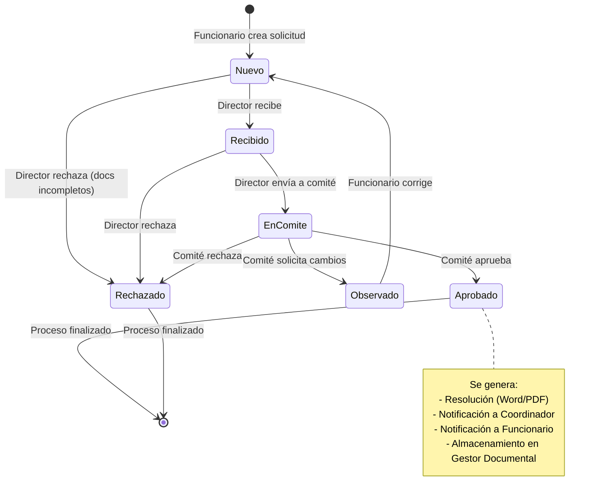

# Sistema de Flujo de Estados - Solicitudes

## 📋 Resumen Ejecutivo

Este documento describe el flujo completo de estados para el sistema de solicitudes, incluyendo roles, transiciones, documentos requeridos y notificaciones automáticas.

**Fecha de Creación:** 2025-12-15  
**Estado:** 📝 Planificación - Pendiente de Implementación

---

## 🎯 Objetivos del Sistema

1. **Trazabilidad completa** de cada solicitud desde su creación hasta su aprobación/rechazo
2. **Gestión documental** automatizada con almacenamiento organizado
3. **Notificaciones automáticas** en cada cambio de estado
4. **Validación de documentos** según el tipo de solicitud
5. **Flujo de aprobaciones** con múltiples niveles (Funcionario → Director → Comité → Coordinador)

---

## 👥 Roles del Sistema

| Rol | Descripción | Permisos |
|-----|-------------|----------|
| **Funcionario** | Crea y edita solicitudes | Crear, editar (solo en estado "nuevo" o "observado"), ver propias |
| **Director de Centro** | Revisa y envía a comité | Recibir, rechazar, enviar a comité, devolver con observaciones |
| **Miembro de Comité** | Evalúa solicitudes | Aprobar, rechazar, agregar observaciones |
| **Coordinador de Centro** | Recibe notificación final | Ver solicitudes aprobadas de su centro |
| **Administrador** | Gestión completa | Todos los permisos |

---

## 📊 Estados de la Solicitud



### Descripción de Estados

| Estado | Código | Descripción | Siguiente Acción |
|--------|--------|-------------|------------------|
| **Nuevo** | `nuevo` | Solicitud creada por funcionario | Director debe revisar |
| **Recibido** | `recibido` | Director ha recibido y validado documentos | Director envía a comité |
| **En Comité** | `en_comite` | Solicitud en evaluación por comité | Comité decide |
| **Observado** | `observado` | Requiere correcciones del funcionario | Funcionario edita |
| **Aprobado** | `aprobado` | Solicitud aprobada por comité | Proceso finalizado |
| **Rechazado** | `rechazado` | Solicitud rechazada | Proceso finalizado |

---

## 📁 Tipos de Solicitud y Documentos Requeridos

### 1. Diplomado - Proyección Social (Gratis)

**Documentos Requeridos:**
- [ ] Formato 003 (generado automáticamente)
- [ ] Acta de Comité (adjuntada por comité al aprobar)
- [ ] Resolución (generada automáticamente al aprobar)

**Documentos Opcionales:**
- [ ] Otros documentos

**Nota:** NO requiere ficha técnica

### 2. Diplomado - Extensión

**Documentos Requeridos:**
- [ ] Ficha Técnica (Excel - generado automáticamente)
- [ ] Formato 003 (generado automáticamente)
- [ ] Acta de Comité (adjuntada por comité al aprobar)
- [ ] Resolución (generada automáticamente al aprobar)

**Documentos Opcionales:**
- [ ] Solicitud de Designación de Coordinadores
- [ ] Disminución del Gasto Administrativo
- [ ] Otros documentos

### 3. Contrato

**Documentos Requeridos:**
- [ ] Ficha Técnica (Excel - generado automáticamente)
- [ ] Formato 003 (generado automáticamente)
- [ ] Contrato (adjuntado por funcionario)
- [ ] Acta de Comité (adjuntada por comité al aprobar)
- [ ] Resolución (generada automáticamente al aprobar)

**Documentos Opcionales:**
- [ ] Solicitud de Designación de Coordinadores
- [ ] Disminución del Gasto Administrativo
- [ ] Otros documentos

### 4. Convenio

**Documentos Requeridos:**
- [ ] Ficha Técnica (Excel - generado automáticamente)
- [ ] Formato 003 (generado automáticamente)
- [ ] Convenio (adjuntado por funcionario)
- [ ] Acta de Comité (adjuntada por comité al aprobar)
- [ ] Resolución (generada automáticamente al aprobar)

**Documentos Opcionales:**
- [ ] Solicitud de Designación de Coordinadores
- [ ] Disminución del Gasto Administrativo
- [ ] Otros documentos

---

## 🔄 Flujo Detallado de Transiciones

### 1️⃣ Creación de Solicitud (Funcionario)

**Estado Inicial:** `nuevo`

**Acciones:**
1. Funcionario completa formulario de solicitud
2. Sistema extrae nombre del proyecto de la Ficha Técnica (Fila #10)
3. Sistema genera automáticamente:
   - Ficha Técnica (Excel) - si aplica
   - Formato 003
4. Funcionario adjunta documentos requeridos según tipo
5. Sistema crea directorio en Gestor Documental: `/proyectos/{nombre_proyecto}/`
6. Sistema almacena documentos en el directorio

**Notificaciones:**
- ✉️ Al Director del Centro: "Nueva solicitud creada por {funcionario}"

**Validaciones:**
- ✅ Todos los documentos requeridos están adjuntos
- ✅ Nombre del proyecto extraído correctamente
- ✅ Tipo de solicitud seleccionado

---

### 2️⃣ Recepción por Director

**Transición:** `nuevo` → `recibido`

**Acciones del Director:**
1. Revisa la solicitud y documentos
2. Valida que todos los documentos requeridos estén completos
3. Opciones:
   - ✅ **Recibir:** Cambia estado a `recibido`
   - ❌ **Rechazar:** Cambia estado a `rechazado` (debe indicar motivo)

**Notificaciones:**
- Si **recibe:**
  - ✉️ Al Funcionario: "Tu solicitud ha sido recibida por el director"
- Si **rechaza:**
  - ✉️ Al Funcionario: "Tu solicitud ha sido rechazada. Motivo: {motivo}"

**Validaciones:**
- ✅ Director pertenece al centro de la solicitud
- ✅ Motivo de rechazo es obligatorio si rechaza

---

### 3️⃣ Envío a Comité (Director)

**Transición:** `recibido` → `en_comite`

**Acciones del Director:**
1. Selecciona el comité que evaluará la solicitud
2. Sistema asigna la solicitud al grupo de usuarios del comité
3. Cambia estado a `en_comite`

**Notificaciones:**
- ✉️ A todos los Miembros del Comité: "Nueva solicitud para evaluar: {nombre_proyecto}"
- ✉️ Al Funcionario: "Tu solicitud ha sido enviada a comité"

**Validaciones:**
- ✅ Comité seleccionado existe y está activo
- ✅ Comité tiene al menos un miembro

---

### 4️⃣ Evaluación en Comité

**Estado Actual:** `en_comite`

**Opciones del Comité:**

#### Opción A: Aprobar
**Transición:** `en_comite` → `aprobado`

**Acciones:**
1. Comité adjunta Acta de Comité (PDF)
2. Sistema genera Resolución (Word/PDF) automáticamente
3. Sistema almacena ambos documentos en `/proyectos/{nombre_proyecto}/`
4. Cambia estado a `aprobado`

**Notificaciones:**
- ✉️ Al Coordinador del Centro: "Solicitud aprobada: {nombre_proyecto}"
- ✉️ Al Funcionario: "¡Tu solicitud ha sido aprobada!"
- ✉️ Al Director del Centro: "Solicitud aprobada: {nombre_proyecto}"

**Documentos Generados:**
- 📄 Resolución (Word/PDF)
- 📄 Acta de Comité (adjuntada)

#### Opción B: Rechazar
**Transición:** `en_comite` → `rechazado`

**Acciones:**
1. Comité indica motivo de rechazo
2. Cambia estado a `rechazado`

**Notificaciones:**
- ✉️ Al Funcionario: "Tu solicitud ha sido rechazada. Motivo: {motivo}"
- ✉️ Al Director del Centro: "Solicitud rechazada: {nombre_proyecto}"

#### Opción C: Solicitar Observaciones
**Transición:** `en_comite` → `observado`

**Acciones:**
1. Comité agrega observaciones/comentarios
2. Director recibe la solicitud con observaciones
3. Cambia estado a `observado`

**Notificaciones:**
- ✉️ Al Director del Centro: "Solicitud con observaciones: {nombre_proyecto}"

**Validaciones:**
- ✅ Observaciones no pueden estar vacías
- ✅ Acta de comité es obligatoria para aprobar

---

### 5️⃣ Gestión de Observaciones (Director)

**Estado Actual:** `observado`

**Acciones del Director:**
1. Revisa las observaciones del comité
2. Opciones:
   - 🔄 **Devolver al Funcionario:** Para que corrija según observaciones
   - ❌ **Rechazar:** Si las observaciones son críticas

**Si devuelve al Funcionario:**
**Transición:** `observado` → `nuevo`

**Notificaciones:**
- ✉️ Al Funcionario: "Tu solicitud requiere correcciones. Observaciones: {observaciones}"

**Acciones del Funcionario:**
1. Edita la solicitud según observaciones
2. Actualiza documentos si es necesario
3. Vuelve a enviar (estado regresa a `nuevo`)

---

## 🗂️ Estructura del Gestor Documental

```
/proyectos/
  /{nombre_proyecto}/
    /solicitud/
      - ficha_tecnica.xlsx (si aplica)
      - formato_003.pdf
      - contrato.pdf (si aplica)
      - convenio.pdf (si aplica)
      - solicitud_coordinadores.pdf (opcional)
      - disminucion_gasto.pdf (opcional)
      - otros_documentos/ (opcional)
    /comite/
      - acta_comite.pdf
    /resolucion/
      - resolucion.pdf
      - resolucion.docx
```

**Nomenclatura de Archivos:**
- `{nombre_proyecto}_ficha_tecnica_{fecha}.xlsx`
- `{nombre_proyecto}_formato_003_{fecha}.pdf`
- `{nombre_proyecto}_acta_comite_{fecha}.pdf`
- `{nombre_proyecto}_resolucion_{fecha}.pdf`

---

## 🔔 Sistema de Notificaciones

### Eventos que Generan Notificaciones

| Evento | Destinatarios | Tipo | Mensaje |
|--------|---------------|------|---------|
| Solicitud creada | Director del Centro | `info` | "Nueva solicitud creada por {funcionario}: {proyecto}" |
| Solicitud recibida | Funcionario | `success` | "Tu solicitud ha sido recibida por el director" |
| Solicitud rechazada (Director) | Funcionario | `error` | "Tu solicitud ha sido rechazada. Motivo: {motivo}" |
| Enviada a comité | Miembros del Comité, Funcionario | `info` | "Solicitud enviada a comité: {proyecto}" |
| Solicitud aprobada | Funcionario, Coordinador, Director | `success` | "¡Solicitud aprobada! {proyecto}" |
| Solicitud rechazada (Comité) | Funcionario, Director | `error` | "Solicitud rechazada por comité. Motivo: {motivo}" |
| Observaciones agregadas | Director | `warning` | "Solicitud con observaciones: {proyecto}" |
| Devuelta al funcionario | Funcionario | `warning` | "Tu solicitud requiere correcciones" |

---

## 🗄️ Modelo de Base de Datos

### Tabla: `solicitudes`

```sql
CREATE TABLE IF NOT EXISTS public.solicitudes (
  id UUID DEFAULT gen_random_uuid() PRIMARY KEY,
  
  -- Información básica
  nombre_proyecto TEXT NOT NULL,
  tipo_solicitud TEXT NOT NULL CHECK (tipo_solicitud IN (
    'diplomado_proyeccion_social',
    'diplomado_extension',
    'contrato',
    'convenio'
  )),
  descripcion TEXT,
  
  -- Estado y flujo
  estado TEXT NOT NULL DEFAULT 'nuevo' CHECK (estado IN (
    'nuevo',
    'recibido',
    'en_comite',
    'observado',
    'aprobado',
    'rechazado'
  )),
  
  -- Relaciones
  funcionario_id UUID NOT NULL REFERENCES auth.users(id),
  centro_id UUID NOT NULL REFERENCES centers(id),
  director_id UUID REFERENCES auth.users(id),
  comite_id UUID REFERENCES comites(id),
  coordinador_id UUID REFERENCES auth.users(id),
  
  -- Documentos (rutas en storage)
  ficha_tecnica_path TEXT,
  formato_003_path TEXT,
  contrato_path TEXT,
  convenio_path TEXT,
  acta_comite_path TEXT,
  resolucion_path TEXT,
  solicitud_coordinadores_path TEXT,
  disminucion_gasto_path TEXT,
  otros_documentos JSONB DEFAULT '[]'::jsonb,
  
  -- Observaciones y comentarios
  observaciones TEXT,
  motivo_rechazo TEXT,
  comentarios JSONB DEFAULT '[]'::jsonb,
  
  -- Auditoría
  created_at TIMESTAMPTZ DEFAULT NOW(),
  updated_at TIMESTAMPTZ DEFAULT NOW(),
  fecha_recibido TIMESTAMPTZ,
  fecha_enviado_comite TIMESTAMPTZ,
  fecha_aprobado TIMESTAMPTZ,
  fecha_rechazado TIMESTAMPTZ
);

-- Índices
CREATE INDEX idx_solicitudes_estado ON public.solicitudes(estado);
CREATE INDEX idx_solicitudes_funcionario ON public.solicitudes(funcionario_id);
CREATE INDEX idx_solicitudes_centro ON public.solicitudes(centro_id);
CREATE INDEX idx_solicitudes_comite ON public.solicitudes(comite_id);
CREATE INDEX idx_solicitudes_created_at ON public.solicitudes(created_at DESC);
```

### Tabla: `comites`

```sql
CREATE TABLE IF NOT EXISTS public.comites (
  id UUID DEFAULT gen_random_uuid() PRIMARY KEY,
  nombre TEXT NOT NULL,
  descripcion TEXT,
  centro_id UUID REFERENCES centers(id),
  activo BOOLEAN DEFAULT TRUE,
  created_at TIMESTAMPTZ DEFAULT NOW(),
  updated_at TIMESTAMPTZ DEFAULT NOW()
);
```

### Tabla: `comite_miembros`

```sql
CREATE TABLE IF NOT EXISTS public.comite_miembros (
  id UUID DEFAULT gen_random_uuid() PRIMARY KEY,
  comite_id UUID NOT NULL REFERENCES comites(id) ON DELETE CASCADE,
  user_id UUID NOT NULL REFERENCES auth.users(id) ON DELETE CASCADE,
  rol TEXT DEFAULT 'miembro' CHECK (rol IN ('presidente', 'secretario', 'miembro')),
  created_at TIMESTAMPTZ DEFAULT NOW(),
  UNIQUE(comite_id, user_id)
);
```

### Tabla: `solicitud_historial`

```sql
CREATE TABLE IF NOT EXISTS public.solicitud_historial (
  id UUID DEFAULT gen_random_uuid() PRIMARY KEY,
  solicitud_id UUID NOT NULL REFERENCES solicitudes(id) ON DELETE CASCADE,
  estado_anterior TEXT,
  estado_nuevo TEXT NOT NULL,
  user_id UUID NOT NULL REFERENCES auth.users(id),
  comentario TEXT,
  created_at TIMESTAMPTZ DEFAULT NOW()
);
```

---

## ✅ Checklist de Implementación

### Fase 1: Base de Datos
- [ ] Crear tabla `comites`
- [ ] Crear tabla `comite_miembros`
- [ ] Modificar tabla `solicitudes` con nuevos campos
- [ ] Crear tabla `solicitud_historial`
- [ ] Configurar políticas RLS para todas las tablas
- [ ] Crear triggers para auditoría automática
- [ ] Crear función para validar transiciones de estado

### Fase 2: Backend - Validaciones
- [ ] Crear función para validar documentos requeridos según tipo
- [ ] Crear función para validar transiciones de estado
- [ ] Crear función para extraer nombre de proyecto de Excel (fila #10)
- [ ] Crear función para generar Formato 003
- [ ] Crear función para generar Resolución (Word/PDF)
- [ ] Implementar almacenamiento en Supabase Storage

### Fase 3: Backend - API Routes
- [ ] `POST /api/solicitudes` - Crear solicitud
- [ ] `PATCH /api/solicitudes/[id]/recibir` - Director recibe
- [ ] `PATCH /api/solicitudes/[id]/rechazar` - Rechazar (Director o Comité)
- [ ] `PATCH /api/solicitudes/[id]/enviar-comite` - Enviar a comité
- [ ] `PATCH /api/solicitudes/[id]/aprobar` - Aprobar (Comité)
- [ ] `PATCH /api/solicitudes/[id]/observar` - Agregar observaciones
- [ ] `PATCH /api/solicitudes/[id]/devolver` - Devolver a funcionario
- [ ] `GET /api/solicitudes/[id]/historial` - Ver historial de cambios

### Fase 4: Frontend - Componentes
- [ ] Componente `SolicitudForm` - Formulario de creación
- [ ] Componente `SolicitudCard` - Tarjeta de solicitud
- [ ] Componente `SolicitudDetalle` - Vista detallada
- [ ] Componente `EstadoBadge` - Badge de estado con colores
- [ ] Componente `DocumentosList` - Lista de documentos
- [ ] Componente `UploadDocumento` - Subir documentos
- [ ] Componente `HistorialTimeline` - Timeline de cambios
- [ ] Componente `ComentariosPanel` - Panel de comentarios

### Fase 5: Frontend - Vistas por Rol
- [ ] Vista Funcionario: Mis Solicitudes
- [ ] Vista Funcionario: Crear Solicitud
- [ ] Vista Funcionario: Editar Solicitud (solo en estado nuevo/observado)
- [ ] Vista Director: Solicitudes Pendientes
- [ ] Vista Director: Revisar Solicitud
- [ ] Vista Comité: Solicitudes en Evaluación
- [ ] Vista Comité: Evaluar Solicitud
- [ ] Vista Coordinador: Solicitudes Aprobadas

### Fase 6: Gestor Documental
- [ ] Configurar buckets en Supabase Storage
- [ ] Implementar estructura de carpetas automática
- [ ] Implementar nomenclatura de archivos
- [ ] Crear función para generar ZIP de todos los documentos
- [ ] Implementar preview de documentos (PDF, Excel, Word)

### Fase 7: Notificaciones
- [ ] Integrar con sistema de notificaciones existente
- [ ] Crear notificaciones para cada transición de estado
- [ ] Implementar notificaciones por email (opcional)
- [ ] Crear dashboard de notificaciones pendientes

### Fase 8: Generación de Documentos
- [ ] Implementar generación de Formato 003 (PDF)
- [ ] Implementar generación de Resolución (Word/PDF)
- [ ] Crear plantillas editables
- [ ] Implementar extracción de datos de Excel (fila #10)
- [ ] Validar formato de Ficha Técnica

### Fase 9: Testing
- [ ] Probar flujo completo: Funcionario → Director → Comité → Aprobado
- [ ] Probar flujo con observaciones
- [ ] Probar flujo con rechazo
- [ ] Probar validaciones de documentos
- [ ] Probar permisos por rol
- [ ] Probar notificaciones
- [ ] Probar generación de documentos

### Fase 10: Documentación
- [ ] Documentar API endpoints
- [ ] Crear manual de usuario por rol
- [ ] Documentar proceso de aprobación
- [ ] Crear guía de troubleshooting

---

## 🎨 Diseño de UI/UX

### Estados Visuales

```
┌─────────────────────────────────────────┐
│ 🆕 Nuevo                                │
│ Color: Azul (#3B82F6)                   │
│ Icono: DocumentPlusIcon                 │
└─────────────────────────────────────────┘

┌─────────────────────────────────────────┐
│ 📥 Recibido                             │
│ Color: Índigo (#6366F1)                 │
│ Icono: InboxIcon                        │
└─────────────────────────────────────────┘

┌─────────────────────────────────────────┐
│ 👥 En Comité                            │
│ Color: Púrpura (#8B5CF6)                │
│ Icono: UserGroupIcon                    │
└─────────────────────────────────────────┘

┌─────────────────────────────────────────┐
│ 📝 Observado                            │
│ Color: Amarillo (#F59E0B)               │
│ Icono: ExclamationTriangleIcon          │
└─────────────────────────────────────────┘

┌─────────────────────────────────────────┐
│ ✅ Aprobado                             │
│ Color: Verde (#10B981)                  │
│ Icono: CheckCircleIcon                  │
└─────────────────────────────────────────┘

┌─────────────────────────────────────────┐
│ ❌ Rechazado                            │
│ Color: Rojo (#EF4444)                   │
│ Icono: XCircleIcon                      │
└─────────────────────────────────────────┘
```

### Timeline de Historial

```
┌─────────────────────────────────────────┐
│ Historial de la Solicitud               │
├─────────────────────────────────────────┤
│                                         │
│ ● 15/12/2025 10:30 AM                  │
│   Solicitud creada                      │
│   Por: Juan Pérez (Funcionario)         │
│                                         │
│ ● 15/12/2025 02:15 PM                  │
│   Recibida por director                 │
│   Por: María García (Director)          │
│                                         │
│ ● 16/12/2025 09:00 AM                  │
│   Enviada a comité                      │
│   Por: María García (Director)          │
│   Comité: Comité de Extensión           │
│                                         │
│ ● 18/12/2025 11:45 AM                  │
│   Aprobada                              │
│   Por: Carlos López (Comité)            │
│   Observaciones: Excelente propuesta    │
│                                         │
└─────────────────────────────────────────┘
```

---

## 🔒 Permisos y Seguridad

### Matriz de Permisos

| Acción | Funcionario | Director | Comité | Coordinador | Admin |
|--------|-------------|----------|--------|-------------|-------|
| Crear solicitud | ✅ | ❌ | ❌ | ❌ | ✅ |
| Ver propias solicitudes | ✅ | ❌ | ❌ | ❌ | ✅ |
| Editar solicitud (nuevo/observado) | ✅ | ❌ | ❌ | ❌ | ✅ |
| Ver solicitudes del centro | ❌ | ✅ | ❌ | ✅ | ✅ |
| Recibir solicitud | ❌ | ✅ | ❌ | ❌ | ✅ |
| Rechazar solicitud | ❌ | ✅ | ✅ | ❌ | ✅ |
| Enviar a comité | ❌ | ✅ | ❌ | ❌ | ✅ |
| Evaluar en comité | ❌ | ❌ | ✅ | ❌ | ✅ |
| Aprobar solicitud | ❌ | ❌ | ✅ | ❌ | ✅ |
| Agregar observaciones | ❌ | ❌ | ✅ | ❌ | ✅ |
| Ver documentos | ✅ | ✅ | ✅ | ✅ | ✅ |
| Descargar documentos | ✅ | ✅ | ✅ | ✅ | ✅ |

---

## 📊 Métricas y Reportes

### KPIs a Implementar

1. **Tiempo promedio de aprobación** por tipo de solicitud
2. **Tasa de aprobación** por centro
3. **Solicitudes pendientes** por estado
4. **Solicitudes con observaciones** (tasa de devolución)
5. **Documentos faltantes** más comunes
6. **Actividad por comité** (solicitudes evaluadas)

---

## 🚀 Próximos Pasos

1. **Revisar y aprobar** este documento con el equipo
2. **Priorizar fases** de implementación
3. **Asignar recursos** (desarrolladores, tiempo)
4. **Crear mockups** de las interfaces
5. **Comenzar con Fase 1** (Base de Datos)

---

**Última Actualización:** 2025-12-15  
**Versión:** 1.0  
**Estado:** 📝 Pendiente de Aprobación